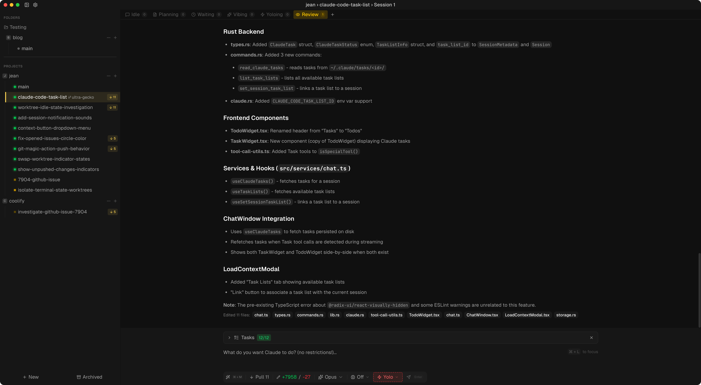
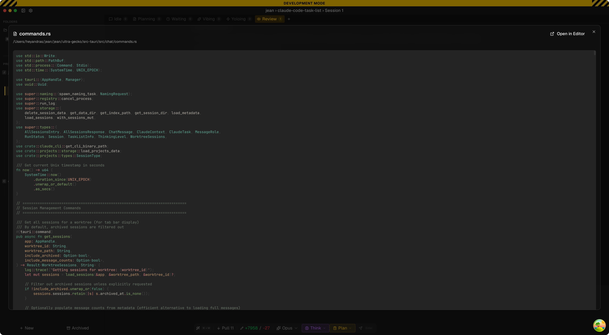
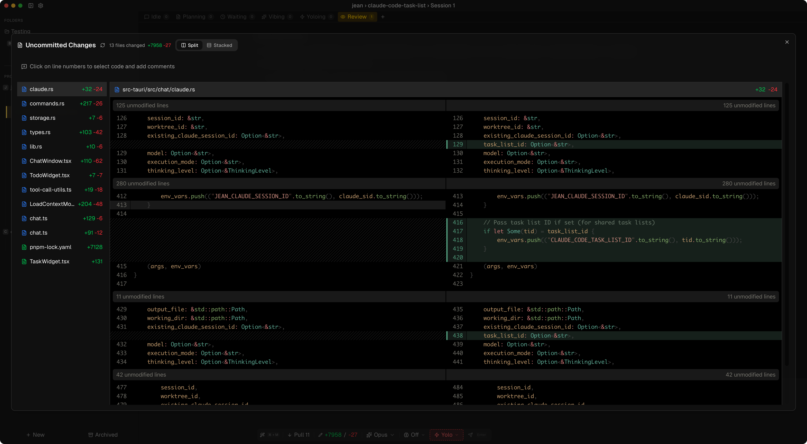
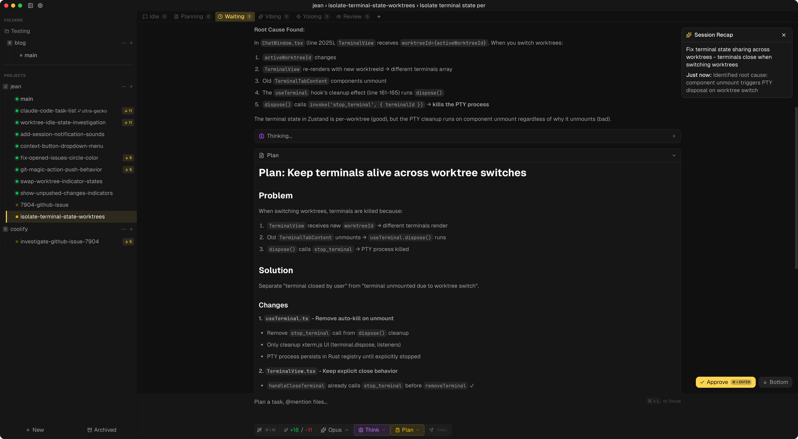

# Jean

Jean (Claude haha) is an AI assistant application that helps you to manage multiple projects, worktrees, session with Claude CLI.

# Features
- Automated worktree management
- Load context from sessions, GitHub Issues / Pull requests
- Automated (magic) Git commands / prompts (review, commit, open PR, investigate issue/pr)
- Automated GitHub PR or local merge worktrees
- Automated merge conflict resolver
- Archive worktrees / branches so you can restore them and continue to work
- A lot more

# Screenshots

# Platform Support

- **macOS**: Tested ✓
- **Windows**: Not tested
- **Linux**: Not tested

# Roadmap
- Add [Opencode](https://opencode.ai/) support
- Add remote access support through an API

# Contributing

See [CONTRIBUTING.md](CONTRIBUTING.md) for development setup and guidelines.

# Philosophy

Learn more about our approach: [Philosophy](https://coollabs.io/philosophy/)

---

Made by [Andras Bacsai](https://x.com/heyandras).